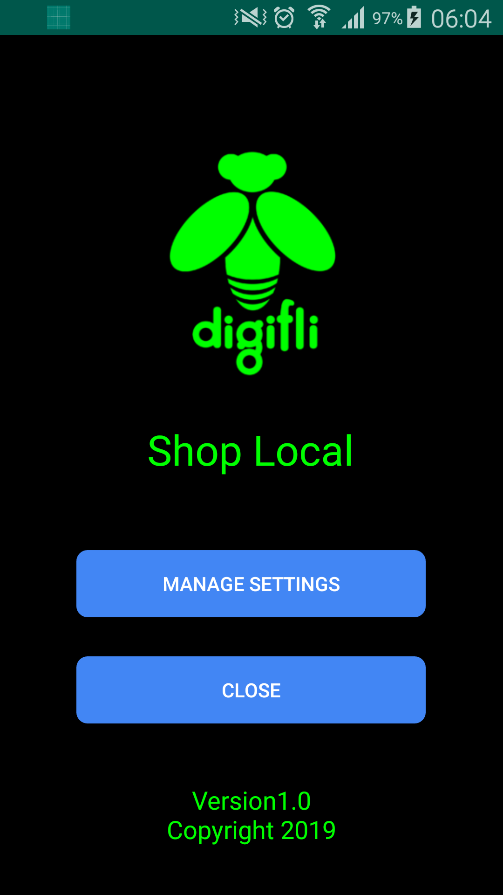
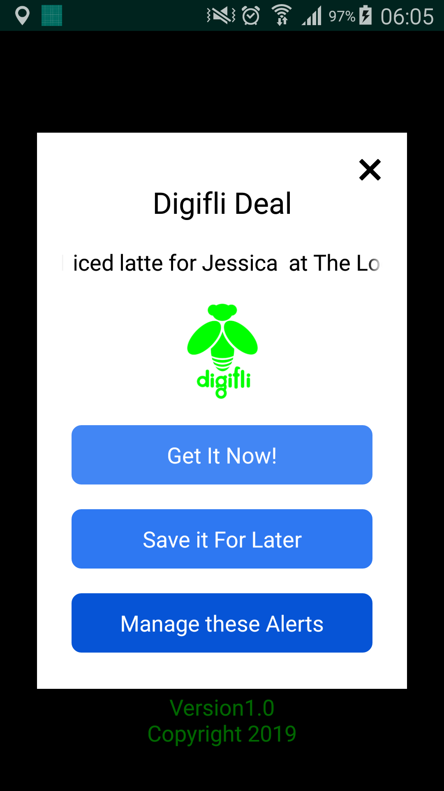

## SendGeoInfo_Android
This is an app MVP to send device id and geo info to backend.

---

## App Name
Digifli

---

## App background service

The background service of the app should send out a post to another url on
the server. It should send the unique device id and the longitude and latitude
coordinates. It should resend this information every 20 minutes*.

---

## Skills

1. Android, Java
2. RESTful API
3. Https, Thread

---

## ScreenShots

    
    

